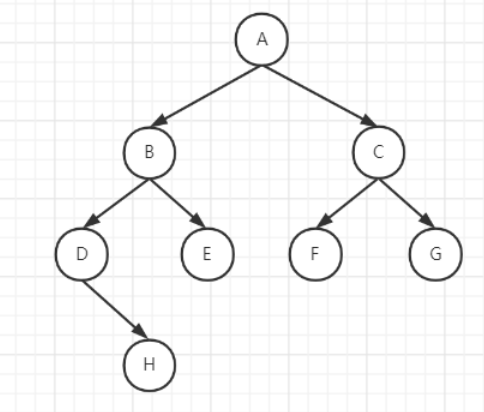

##### 树结构常用术语



①、**路径**：顺着节点的边从一个节点走到另一个节点，所经过的节点的顺序排列就称为“路径”。

②、**根**：树顶端的节点称为根，一棵树只有一个根，如果要把一个节点和边的集合称为树，那么从根到其它任何一个节点都有且只有一条路径。A是根节点

③、**父节点**：若一个节点含有子节点，则这个节点称为其子节点的父节点。

④、**子节点**：一个节点含有的子树节点称为该节点的子节点。F、G是C节点的子节点

⑤、**兄弟节点**：具有相同父节点的节点互称为兄弟节点；F、G节点互为兄弟节点。

⑥、**叶节点**：没有子节点的节点称为叶节点，也叫叶子节点。如E、F、G、H都是叶节点

⑦、**子树**：每个节点都可以作为子树的根，它和它所有的子节点、子节点的子节点都包含在子树中

⑧、**节点的层次**：从根开始定义，根为第一层，根的子节点为第二层，以此内推。

⑨、**深度**：对于任意节点n，n的深度为从根到n的唯一路径长，根的深度为0。（从上往下看）

⑩、**高度**：对于任意节点n，n的高度为从n到一片树叶的最长路径长，所有树叶的高度为0。（从下往上看）


**求二叉树的高度**

```java
public int getHeight(TreeNode node) {
    if (node == null) return 0;
    int i = getHeight(node.left);
    int j = getHeight(node.right);
    return (i < j) ? j + 1 : i + 1;
}
```

**求二叉树的节点数**

```java
public int getSize(TreeNode node) {
    if (node == null) return 0;
    return 1 + getSize(node.left) + getSize(node.right);
}
```

